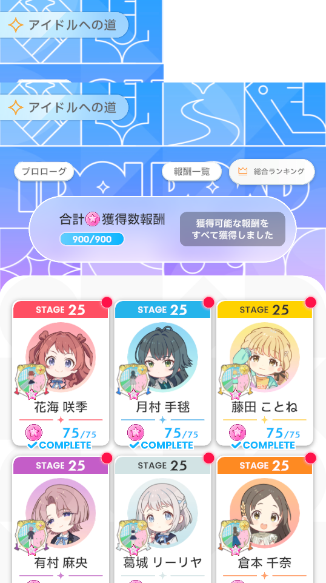
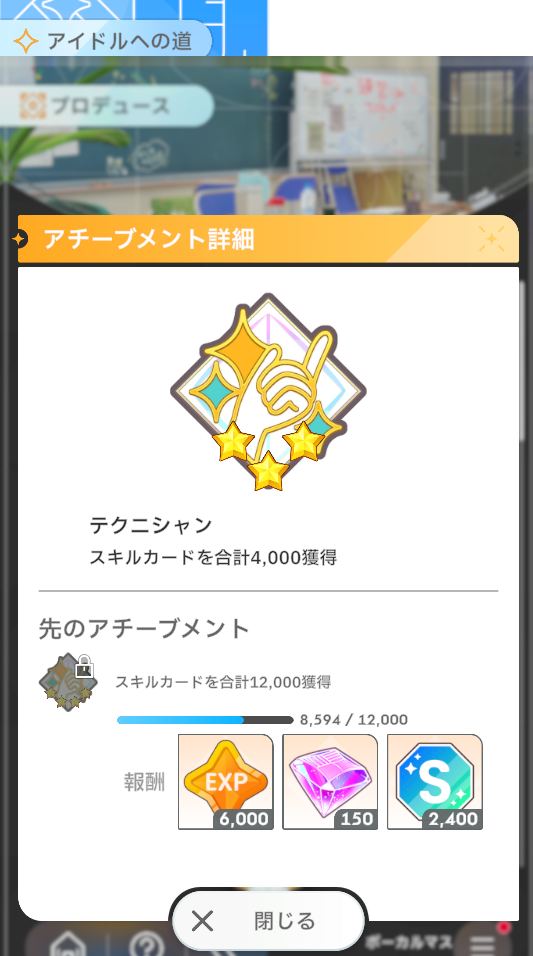

# 学マスのレベルカンストのハードルが思ったより高い

学園アイドルマスター、略して学マスを知っているだろうか。ついこのまえリリース1.5周年を迎えた、由緒正しきアイマスシリーズの最新ブランドのスマホゲーである。

キャラクター、ストーリー、ゲームシステムにコンテンツ量に関して、令和最新アイマスとしてすさまじく高水準であり、かなりの人気コンテンツといっていいだろう。

そんな学マスのゲームは、メインとなるのはもちろんアイドルのストーリー、コミュニケーションとなるわけだが、ゲーム性としてのメインサイクルはローグライトカードゲームの周回による要素開放となっている。「アイドルをプロデュース」という流れに見立て、使い切りとなるデッキを構築しながら数回のカードゲームを行ってクリアまでプレイするという単位で周回を行い、その結果に応じてプレイヤー自身が経験値を獲得しレベルアップすると、プロデュースにおける各種要素が解放されていくことで周回プレイの内容が強化されていくという流れだ。

このサイクルのお陰で、コンテンツの追加を待たずして、プレイヤーはかなりの長い時間、変化し続ける周回プレイを楽しむことができる。それ自体は素晴らしい構造だ。しかし、このサイクルをメインに据える場合、逆に言うとレベルアップが終わり要素の解放が終わってしまうと、周回プレイに変化が無くなってしまう事を意味している。それを防ぐために、学マスにおけるこの「プレイヤーレベルのカンスト」は、ありえないレベルで高いハードルとして設定されている。

俺は一応リリースからほそぼそと遊び続けており、先日「今まであまり気にしたことなかったけど、遊んでるゲームでレベル上限までレベルアップしてないって、結構ゲーマーとしてまずいよなぁ」と思い計算してみたところ、思ったより正気の沙汰ではなかった。

俺のレベル状況を見てみると、こんな感じ。

{.screenshot width="320px" }

現在レベル65で、最大が70。1.5年の運営で何度かレベルの上限は引き延ばされており、一度も最大レベルまで上がったことはない。(なお、最大レベルになっていた場合に得た経験値はちゃんと蓄積されて次の解放時にレベルアップに使われる)

後半は1レベルあげるのに70,000の経験値が必要なので、俺は大体あと300,000ほどの経験値が必要という事になる。では、その経験値というのはどうやって手に入るのか。

応えは単純。一周15分ほどかかる周回プレイを一度やることで、50もらえる。なので単純に考えると、300,000の経験値を得るには1500時間周回することになる。

…………ん？いやいや、さすがにそんなはずは。何かの計算まちがいだろう…。

いや、間違ってない。難解計算しても、それほどの時間がかかる…。

もちろんこれは結構悪意ある書き方で、もちろんこの基本となる一周50の経験値に加え、いろいろな実績を達成した際にもらえる特殊経験値があるにはあるのだが、そんなものはレベル60程に来るまでにすぐ取れる者は枯れてしまう。ここまでくると、何十回も周回すると雀の涙のような数千の経験値がたまに入ってくる程度だ。

{.screenshot width="320px" }
300,000弱の経験値がもらえる「アイドルへの道」。よくレベル上げのためにこれをやれと言われるが、4レベルちょっと分の経験値しかない

{.screenshot width="320px" }
周回上で構築するデッキのカードを入手すると経験値がもらえる。が、その量は「12,000枚手に入れた際に6,000ぽっきり」である。なお一周で手に入るスキルカードは多くて20枚程度

とはいえこのレベルがカンストしてしまうと次のレベル開放が来るまではゲームのメインサイクルが停止することも事実なので、どうあがいても普通にプレイするうえではカンストしない、というのが何ならこのゲームの正しい姿ではあるとは思うのだが。普通に社会人をしながらカンストしている人間は、正直ほかにもっとゲームをやるべきなんじゃないかなと思わなくもない。

が…、自分自身がそんなz間を言い訳にゲームをやりかけにしているのも気色悪いので、今月中…というのは物理的に不可能なのだが、来年の前半中くらいにはレベル70まであげてやりたいな、なんて思っている。

もしかするとそれまでに経験値が追加で手に入る要素が追加されたりして思ったよりマゾくはないマラソンになってしまうかもしれないが。とにかく、千を超える周回を乗り越えて俺は学マスをクリアするぞ。