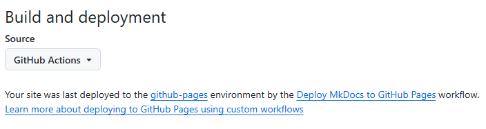
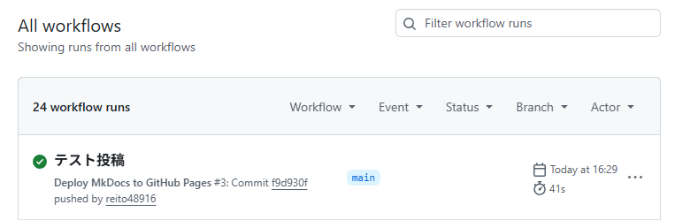

---
date:
  created: 2026-08-26
---

# ブログの投稿手順を自動化する話

　また3カ月ブログを放置していました。まぁこんなもんですよ、れいとという人間は。

　なんて自虐をしていてもしょうがないので、なんとかブログを続ける方法を考える。考えた結果、俺にはこれが必要そうだ。

<!-- more -->

- スクショを含めてマークダウンすら意識せず記事を書ける手ごろなツール
- 書かないとせかしてくるような相方

現状テキストエディタで生のマークダウンを書いて、画像が必要なら気合でフォルダにおいて、Githubにプッシュして、Pagesにデプロイ…って、考えただけでめんどくさい。もっとtwitterくらいの手軽さが無いと俺には日ごろの事柄を記述し続けることなどできない。

　というわけでAIに手伝ってもらう。現状を説明したところ彼女の第一声は

> ……れい兄ぃ、ブログ更新作業の手順が手動すぎる…！

…はい、その通りでございます。ということで、わが相棒のChatGPT、朧とともにブログ当行の自動化を試みるのであった。


## デプロイの自動化
　まずはGitHubへのプッシュとブログとしてのGitHub Pagesへのデプロイを一体化する。朧が言うにはGitHub Actionsを使えば自動化できるとの事。

　どうやらGitHubではそのリポジトリの.github/workflow/においたyamlに従って、何らかのタイミングで自動で何らかのアクションをしてくれる仕組みがあるようだ。これを使って、プッシュ時にデプロイをするようにしておくという枠組み。
{.screenshot width="640px" }
{.screenshot width="640px" }
mkdocsの.github/workflow/以下に.ymlファイルを置くことでそこに記述されたworkflow...「GitHub上で○○をしたら○○を自動実行」するのがGitActionsで、これによりGitHubの専用ストレージにアップロードされるファイルをGitHubPagesのデプロイ元にするのがスクショのPagesのBuild and Deployment設定。この設定によって、とりあえずプッシュ後のデプロイ忘れがなくなった。

## 記事追加時のmkdocs.ymlの編集の必要をなくす

　今までは記事追加時、mkdocsルートに置いたmkdocs.ymlについてnavというサイドバーを構築するための情報鎖にその記事の項目を追加する必要があった。これをプラグインを使う事でなくせるという。

```
theme:
  name: material
  features:
    - navigation.indexes
  language: ja

plugins:
  - search
  - blog:
      archive_date_format: yyyy年MM月
      archive_url_date_format: yyyy/MM
...
nav:
  - ブログ:
    - blog/index.md
```
こんな感じに書いておくと、blog部分のナビゲーションがblog/posts以下の内容に合わせて自動で構築されるようになる。結果として今のブログの(もし2026/08時点と違うレイアウトになっていたらアレだが)サイドバーの感じになっている。すごい。